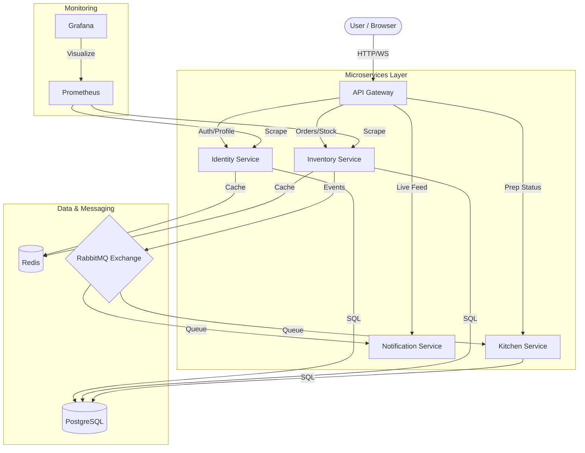

# 🚀 DevSprint: Scalable Microservices Architecture

DevSprint is a high-performance, fault-tolerant microservices platform designed for modern web applications. It implements a robust backend architecture using Node.js, PostgreSQL, Redis, and RabbitMQ, coupled with a beautiful, responsive React frontend.

## 🌟 Motive

The primary goal of **DevSprint** is to provide a seamless, real-time experience for managing complex workflows (like food ordering or inventory tracking) within a student-centric ecosystem. By leveraging a microservices pattern, we ensure individual components can be scaled, updated, and maintained independently, resulting in a system that is both agile and resilient.

---

## 🛠 Tech Stack

### Frontend
- **Framework**: React 19 (Vite)
- **Styling**: Tailwind CSS 4.0
- **Animations**: Framer Motion, Lottie
- **Navigation**: React Router 7
- **Communication**: Axios, Socket.io, SSE (Server-Sent Events)

### Backend (Microservices)
- **Runtime**: Node.js
- **Gateway**: Custom API Gateway with JWT Authentication
- **Databases**: PostgreSQL (Relational), Redis (Caching)
- **Message Broker**: RabbitMQ (Asynchronous Event-Driven Architecture)
- **Containers**: Docker & Docker Compose

### Monitoring & Testing
- **Observability**: Prometheus & Grafana
- **Load Testing**: k6 by Grafana

---

## 🏗 System Architecture



---

## 🛡 Fault Tolerance & Resilience

DevSprint is engineered to handle failures gracefully:

1.  **Service Isolation**: Each microservice runs in its own container. A failure in the `Notification` service will not prevent the `Identity` or `Inventory` services from operating.
2.  **Asynchronous Resilience**: By using **RabbitMQ**, we ensure that critical actions (like placing an order) are decoupled from side effects (like sending notifications). If the notification service is down, the message stays in the queue and is processed once the service recovers.
3.  **Self-Healing**: Docker Compose is configured with `restart: always` for core services, ensuring that crashed containers are automatically rebooted.
4.  **Caching Strategy**: **Redis** is utilized for session management and frequently accessed data, reducing the load on the primary PostgreSQL database and improving response times.
5.  **Observability**: Integrated **Prometheus** and **Grafana** provide real-time metrics, allowing developers to identify and resolve performance bottlenecks or errors before they impact users.
6.  **Load Testing**: Pre-configured **k6** scripts allow for rigorous load and stress testing to ensure the system can handle peak traffic.

---

## 🚀 Getting Started

### Prerequisites
- [Docker & Docker Compose](https://www.docker.com/products/docker-desktop/)
- [Node.js](https://nodejs.org/) (for local frontend development)

### 1. Start the Backend Infrastructure
Navigate to the `server` directory and run:
```bash
cd server
docker compose --profile dev up --build -d
```
*Note: The `--profile dev` flag includes monitoring tools (Grafana/Prometheus).*

### 2. Launch the Frontend
Navigate to the `frontend` directory and run:
```bash
cd frontend
npm install
npm run dev
```

### 3. Access the Services
- **Web App**: [http://localhost:5173](http://localhost:5173)
- **API Gateway**: [http://localhost:5001](http://localhost:5001)
- **Grafana Dashboard**: [http://localhost:3000](http://localhost:3000) (Admin: `admin` / `dhongorsho123`)
- **Prometheus**: [http://localhost:9090](http://localhost:9090)
- **RabbitMQ Management**: [http://localhost:15672](http://localhost:15672)

---

## 📂 Project Structure

- `/frontend`: React application with Tailwind and Framer Motion.
- `/server`: Root for microservices and infra.
  - `/Gateway`: Entry point and request routing.
  - `/Identity`: User authentication and authorization.
  - `/Inventory`: Management of stock and orders.
  - `/Kitchen`: Processing and preparation logic.
  - `/Notification`: Live updates via SSE.
  - `/Grafana` & `/Prometheus`: Configuration for the monitoring stack.
  - `/Database`: Initialization scripts for PostgreSQL.
  - `/Tests`: Performance and unit testing logic.
